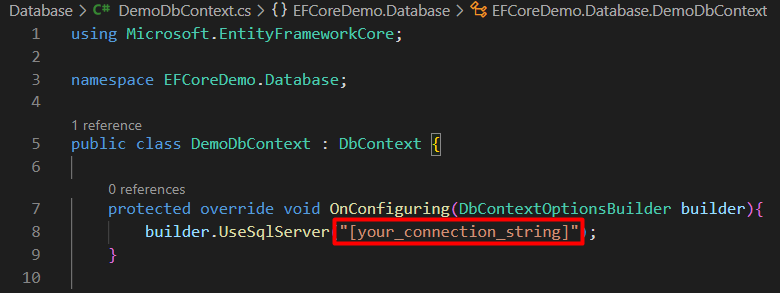

# Entity Framework Core Demo

This is a dotnet 6 console project that contains an example of how to use EF Core to interact with a SQL Server Database.

This example executes DDL (Data Definition Language) and DML (Data Manipulation Language) commands.

## Dependencies

- First you will need to install .NET 6 SDK from [here](https://dotnet.microsoft.com/en-us/download).

- In order to use EF Core CLI tools you will need to install it using `dotnet tool install --global dotnet-ef`. This command will add `dotnet-ef` globally.

- `Microsoft.EntityFrameworkCore.Design` and `Microsoft.EntityFrameworkCore.SqlServer` are declared as packages of our project, after your first run execute `dotnet restore` to download them.

- This project uses SQL Server as Database Engine, to run it locally you need to configure the connection string in `DemoDbContext.cs` file inside Database folder.

  - Go to Database/DemoDbContext.cs

    

  - Replace with your own connection string
  
    

- Now you are ready to run `dotnet ef` commands.

## Your First Migration

- This project has already create the first migration, so you can skip to the last step to apply the existing migration to your database.
  
- At this point you have `DemoDbContext.cs` configured to point to your server connection. Now it's time to create your database model using Entity Framework.

- Open a terminal inside this project and run `dotnet ef migrations add [migration_name]` to create the first migration. Replace [migration_name] with a proper name like CreateDatabase.

- Once you run this command `Entity Framework` will create a new folder called `Migrations` that contains all the necessary to create and configure your database.

    

- Well, migration files are created, but your database isn't. To apply the migration, you need to run `dotnet ef database update` command.

- When migration is applied you are ready to run and debug the project. 😀
